## Projeto Ruby on Rails via Docker
\
Comando para montarmos um docker compose com os containers de Rails, PostgreSQL Sidekiq e Redis:
\
**docker-compose build**
\
\
Comando para executar os containers:
\
**docker-compose up**
\
\
Execute esses comandos no terminal pra finalizar o processo da criação do banco e geração da estrutura  de testes do RSpec:
\
**docker exec -it moke_ror_on_docker-web-1 bash**
\
**rails db:create**
\
**rails generate rspec:install**
\
**rails db:migrate db:test:prepare**

### Teste automatizado(RSpec)
\
Comando para executar os testes automatizados do RSpec(dentro do container moke_ror_on_docker-web-1):
\
**rspec**
\
Caso der o erro(403), utilize a variavel de ambiente de teste:
\
**RAILS_ENV=test**
\
\
Após executar o RSpec necessita retornar esta mensagem:
\
\
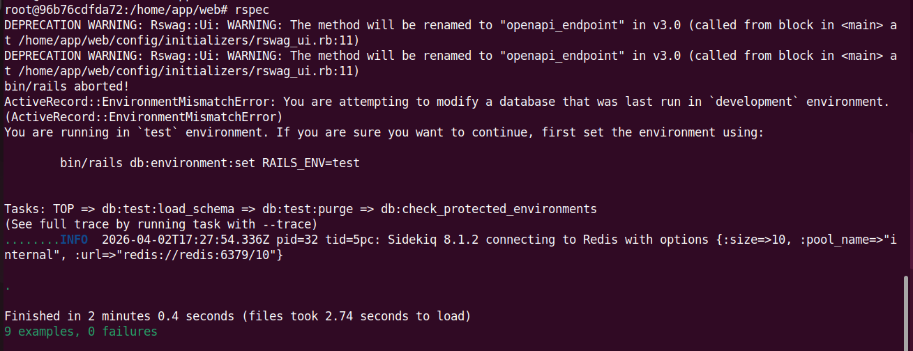

### Projeto sendo executado no navegador
\
Executar o projeto no browser(abra este link em alguma aba): 
\
**http://localhost:3000**
\
\
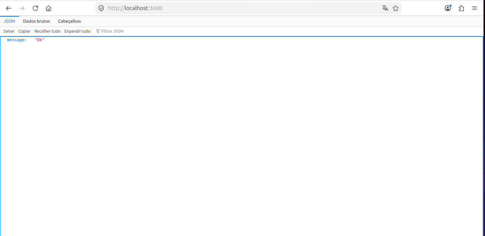

### Documentação API utilizando o Swagger
\
Link da documentação Api: 
\
**http://localhost:3000/api-docs/index.html**
\
\
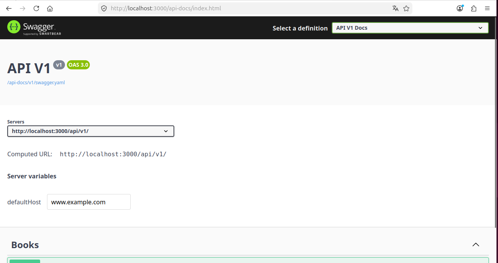
\
\
A imagem abaixo é um exemplo de uma request do verbo Put utilizando o **Swagger**:
\
\
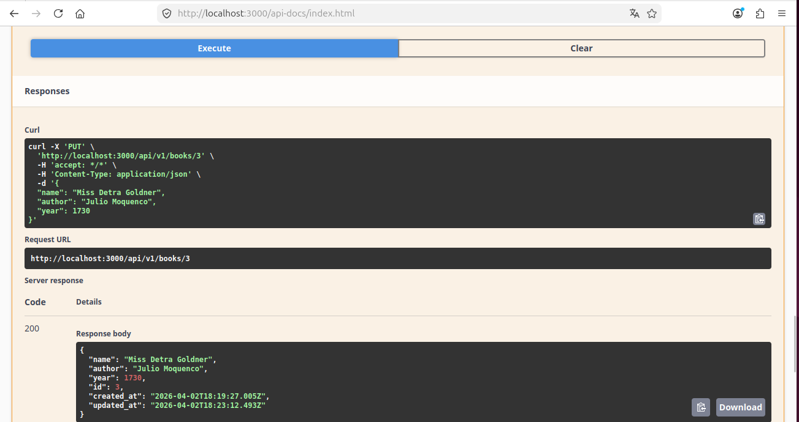

### Requisição RestAPI utilizando a GEM HTTParty
\
Esta imagem abaixo, é de um exemplo testado após consumir uma api externa(Free Weather Api) com a gem **HTTParty**.
\
\

### Monitoramento com o NewRelic
\
Abaixo representa o monitoramento sendo feito pela plataforma de Observabilidade(**NewRelic**).
\
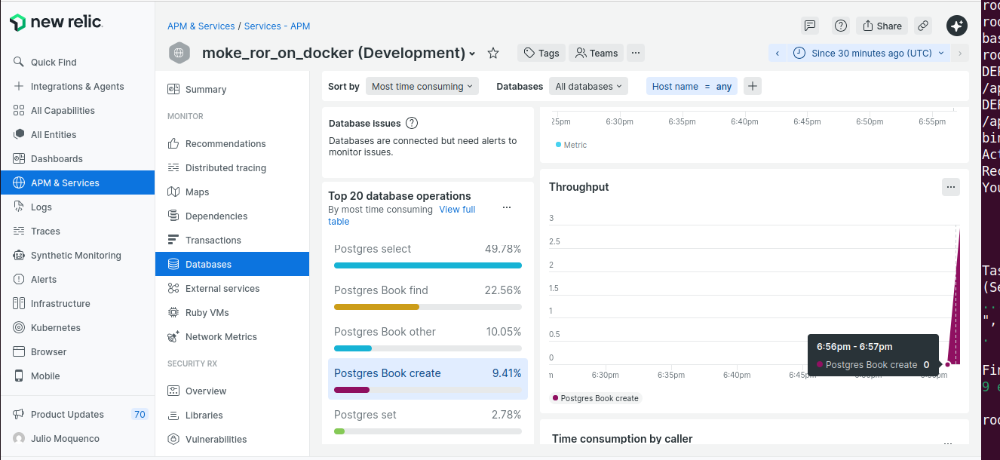
\
\
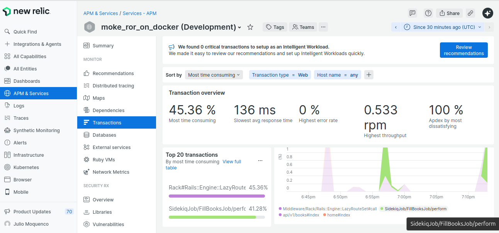
\
\
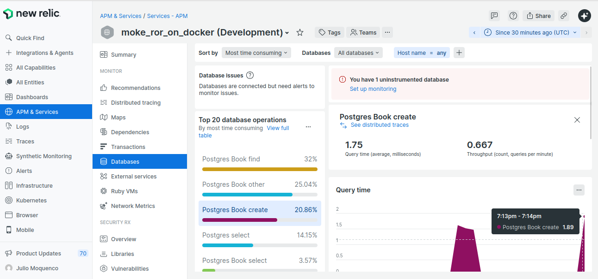

### Utilizando mensageria Amazon AWS SQS
\
As imagens abaixo é de um teste realizado consumindo e produzindo mensagem no serviço de fila da Amazon AWS, após consumir automaticamente realiza a remoção da mensagem.
\
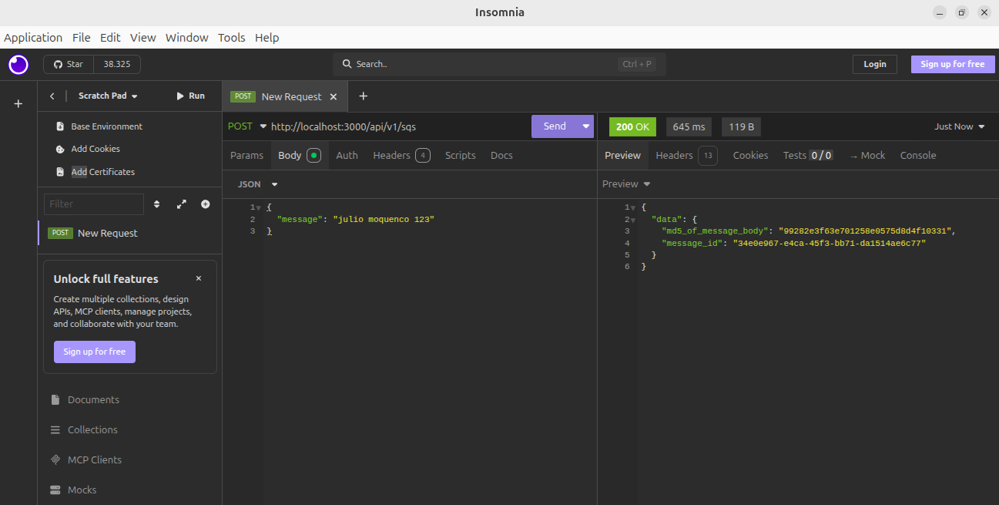
\
\
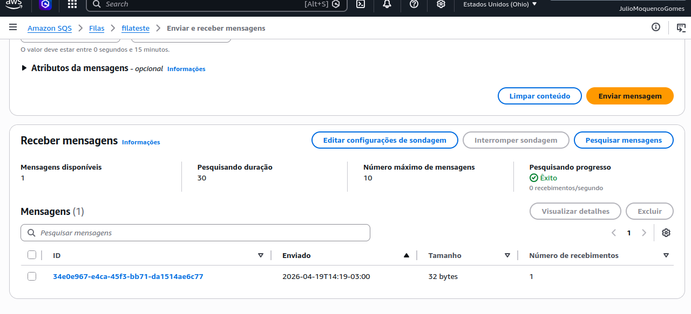
\
\
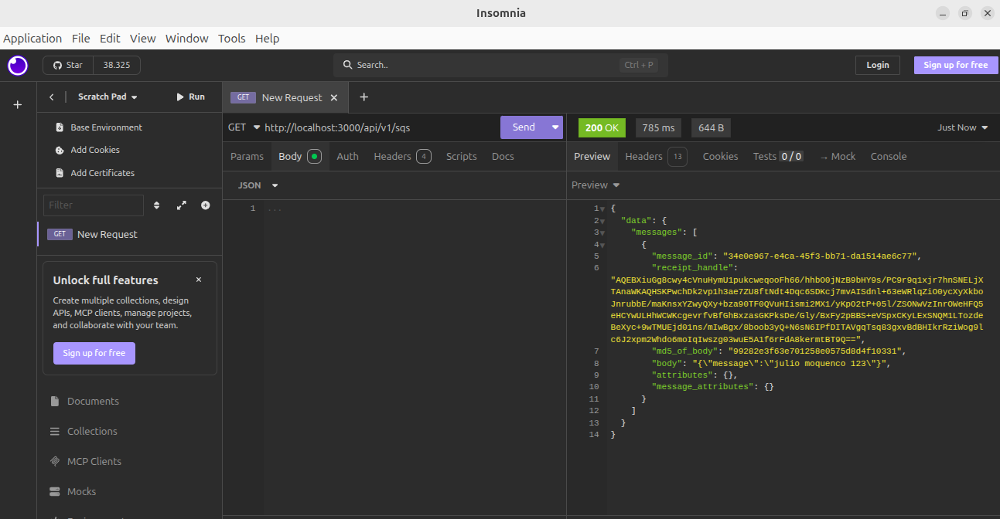
\
\
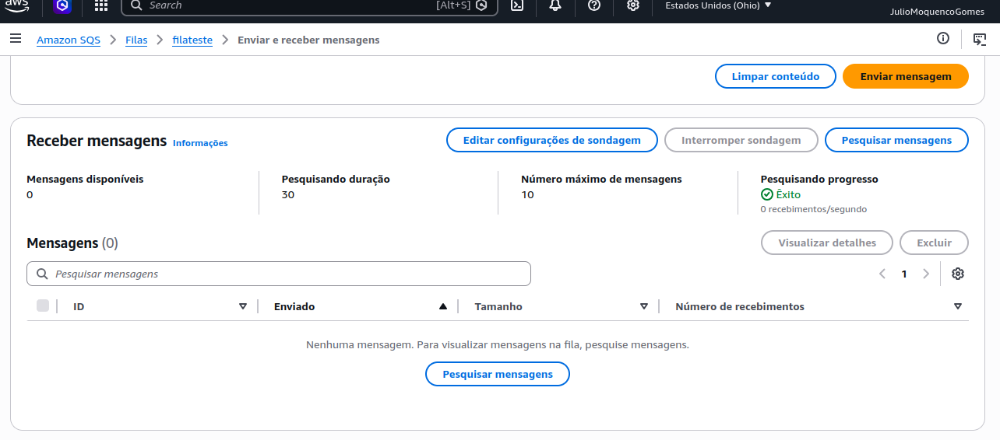